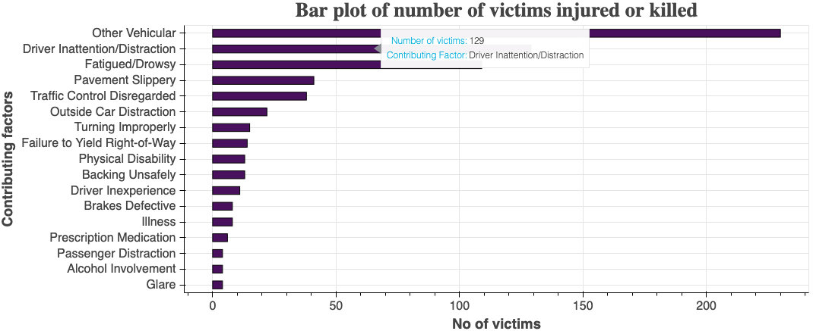
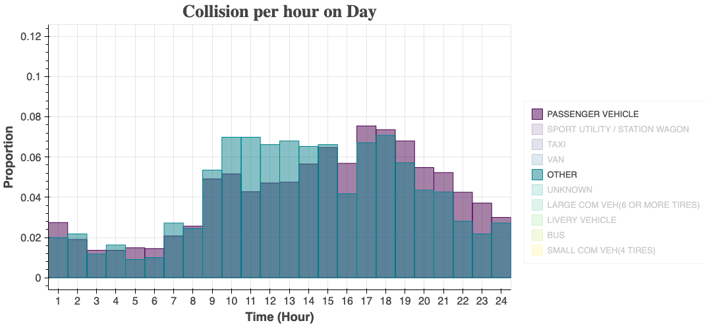

# Motor Vehicle Collisions - Crashes

In this project **Motor Vehicle Collisions** crash dataset has been analysed. The dataset can be downloaded from [Motor Vehicle Collisions](https://data.cityofnewyork.us/Public-Safety/Motor-Vehicle-Collisions-Crashes/h9gi-nx95). The dataset contains 1.69 millions of rows and 29 columns and each rows represents Motor Vehicle Collision. Due to constraints in processing time in order to run the visualisation this plot contains 2/41 parts of the original dataset, this amounts 80 000 observation.

## Table of contents

- [Overview](#overview)
  - [The challenge](#the-challenge)
  - [Screenshot](#screenshot)
  - [Links](#links)
- [My process](#my-process)
  - [Built with](#built-with)
  - [What I learned](#what-i-learned)
  - [Useful resources](#useful-resources)
- [Author](#author)

## Overview

### The challenge

Users should be able to:

- View basic statistics of the dataset
- View interactive plot by selecting different control for example by choosing plot scale, different contributing factor or ranging the slider

### Screenshot

 

### Links

- Live URL: [https://agkabir-nyc-motor-vehicle-collision-app-ebbwvn.streamlit.app](https://agkabir-nyc-motor-vehicle-collision-app-ebbwvn.streamlit.app)

## My process

### Built with

- Python
- Bokeh
- Streamlit
- Matplotlib
- Pandas
- Numpy

### What I learned

- Delopyment of data science projects in streamlit
- Interactive plot using bokeh
- Incorporating bokeh plot in streamlit

### Useful resources

- [Stackoverflow](https://www.stacoverflow.com) - This helped me to discover how to make interactive plot in bokeh.

## Author

<!-- - Website - [Add your name here](https://www.linkedin.com/in/mdagkabir/) -->

- Linked In - [Alamgir Kabir](https://www.linkedin.com/in/mdagkabir)
